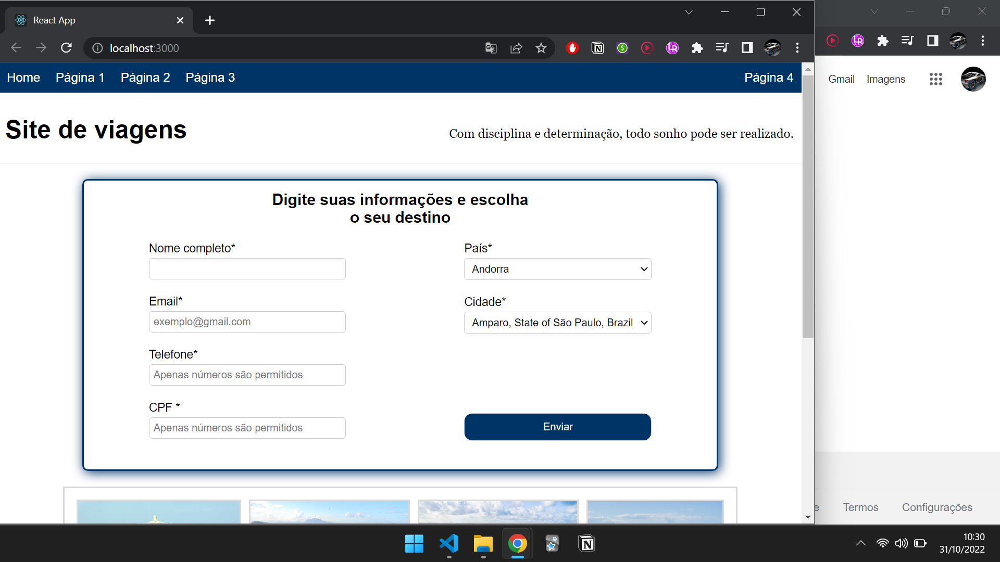
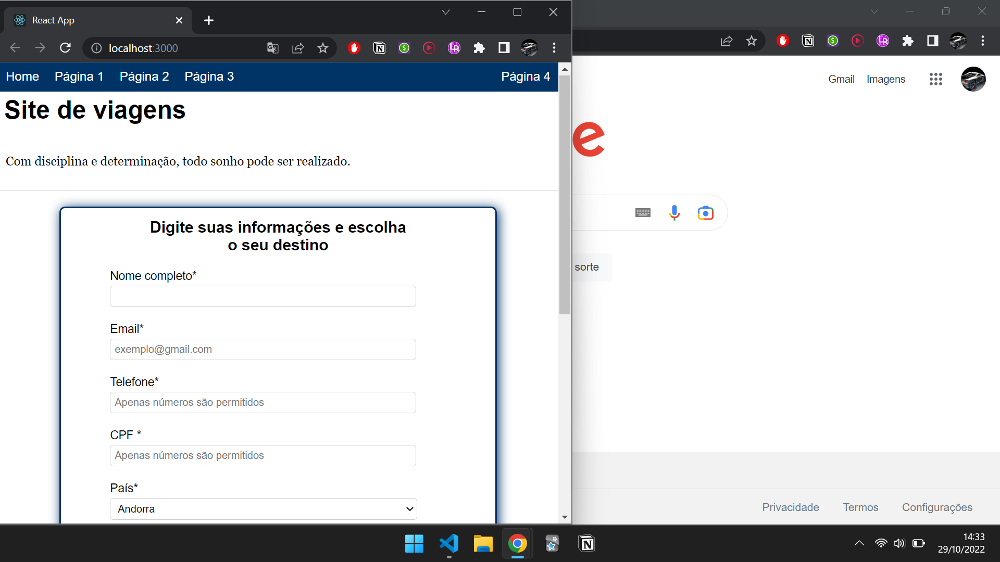

# Sistema de planejamento de viagens
---

</img>

O projeto foi feito em React e consiste em uma página de planejamento de viagens futuras.

## Destaques

- Projeto responsivo com uso de Media Queries e outras técnicas de CSS
- Criação de componetes para futura reutilização
- Código criado para possibilitar a digitação de apenas números nos campos de Telefone e CPF
- Código criado para máscaras de preenchimento nos campos de Telefone e CPF
- Consumo de API da Amazon para obtenção de dados de Países e Cidades
- Manipulação de DOM

## Imagens do projeto em diferentes tamanhos de tela
<<<<<<< HEAD

</img>
</img>
</img>
</img>
</img>
</img>

=======

</img>
</img>
</img>
</img>
>>>>>>> 8d3e322dde933afcd948e58eb4a50f225f8bd150
